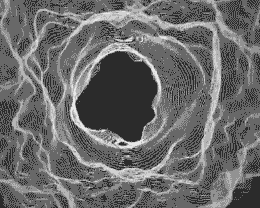
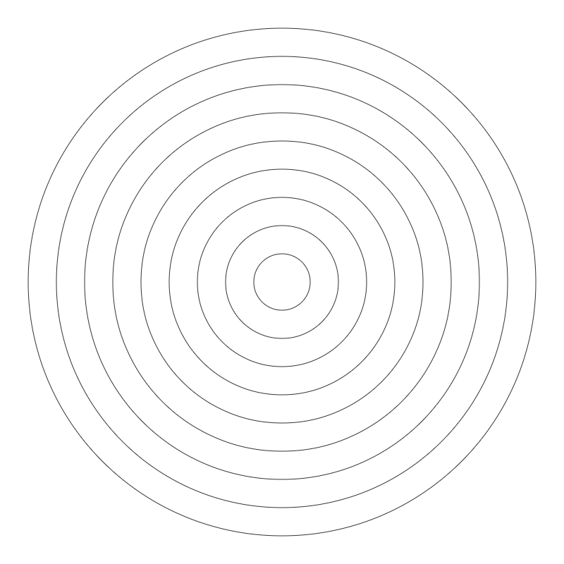
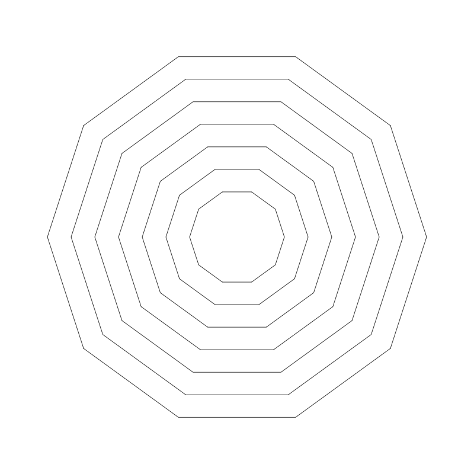
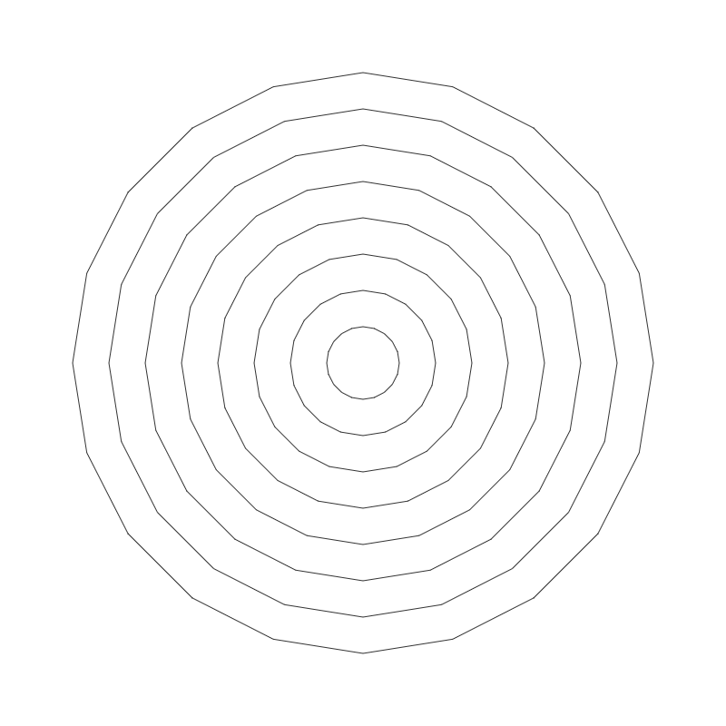
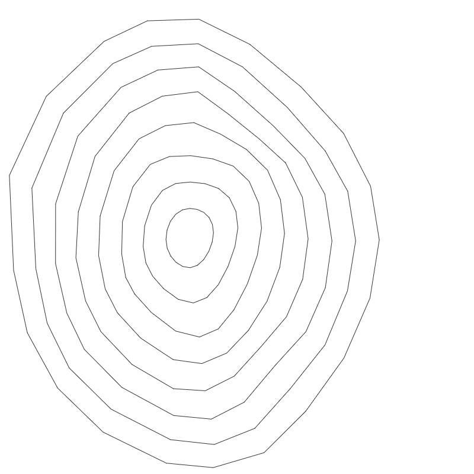
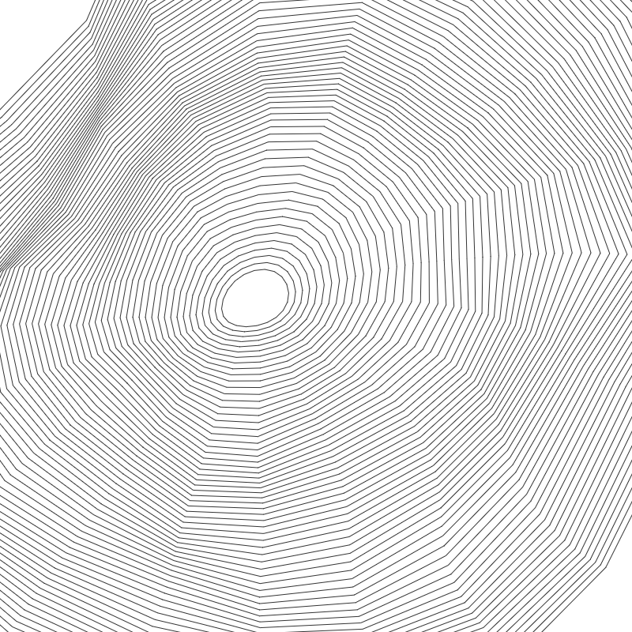
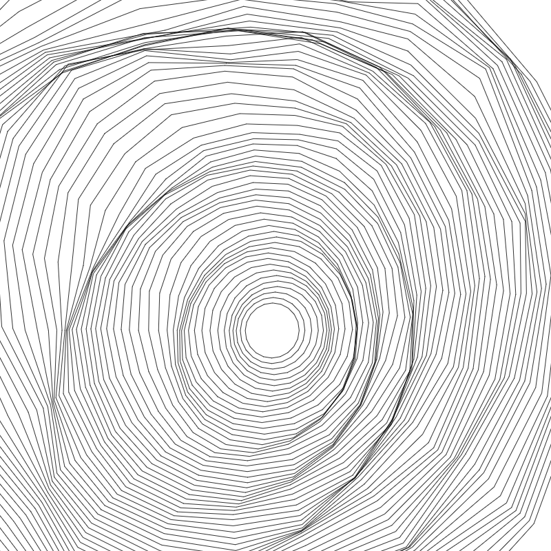

# Recreating the Noise Orbit
In this tutorial I'll be showing how I created this animation. 


You can view it, and more, on my instagram here: [@mr_praline](instagram.com/mr_praline).

## Intro

Like most of my art, this piece began as a recration of another artwork. Specifically, my friend [Zelda](https://github.com/Velfi) asked how I would recreate this great gif by [Jack Perkins](https://github.com/jackaperkins/jackaperkins/blob/master/images/noiseorbit.gif).



So we hopped on a video chat to pair program.

I'll be working in [p5.js](https://p5js.org/) for this tutorial, so anyone can follow along. My original was done with [Quil](http://quil.info), a Clojure wrapper around Processing. The drawing methods and structure are nearly identical. Also, note, most of my code snippets below should be placed inside the `draw` function. I'll leave a comprehensive working example at the end of the tutorial.

## Setting up the Sketch
I like to work with different settings than the defaults. Let's get that set up now.

##Color Space
I prefer using the HSB color space and thinking of hue as rotations in a cylinder. For some more information, and reasoning, take a look at this wonderful article by Tyler Hobbs: [Working with Color in Generative Art](https://tylerxhobbs.com/essays/2016/working-with-color-in-generative-art).

```javascript
function setup() {
  createCanvas(400, 400);

  //             Hue  Sat  Bri  Alpha
  //              v    v    v    v 
  colorMode(HSB, 360, 100, 100, 1.0);
}
```

##Coordinates

Processing and p5.js both use pixel coordinates for drawing primitives. This makes it hard to change the size of your sketch, e.g. 400x400px to 1000x1000px, when you want a nice high-resolution final product. I prfer to use relative coordinates, 0.0 to 1.0, for width and height. To do this, we need two helper functions, also borrowed from Tyler Hobbs: [Using Quild for Artwork](https://tylerxhobbs.com/essays/2015/using-quil-for-artwork).

```javascript
function w(val) {
  if (val == null) return width;
  return width * val;
}

function h(val) {
  if (val == null) return height;
  return height * val;
}
```

##Styles

Just to keep things consistent, throw this at the begining of the `draw` function.

```javascript
funciton draw() {
  background(0, 0, 100);  // white background
  noFill();               // no fill
  stroke(0, 0, 0);        // black stroke
  strokeWeight(w(0.001)); // light stroke weight
}
```

## Basic Structure

Looking at the source material, we see it starts as a series of concentric circles. So let's make that, first.

```javascript
for (let radius = 0.1; radius < 0.4; radius += 0.05) {
  circle(w(0.5), h(0.5), w(radius*2));
}
```

This is what we should see now:



Ok, that's cool, but we want to deform the circles, which we can't do right now. So instead of making each circle using `circle`, let's make them polygons, using `beginShape` and `endShape`. Check out the relevant documentation to understand what's going on: [beginShape](https://p5js.org/reference/#/p5/beginShape).

```javascript
const numSteps = 10;
const radiansPerStep = (Math.PI * 2) / numSteps;

for (let radius = 0.1; radius < 0.4; radius += 0.05) {
  beginShape();
  for (let theta = 0; theta < Math.PI * 2; theta += radiansPerStep) {
    const x = 0.5 + radius * Math.cos(theta);
    const y = 0.5 + radius * Math.sin(theta);
    vertex(w(x), h(y));
  }
  endShape(CLOSE); // CLOSE because the last point is not the first point
}
```

Now what we should see is something like this:



Try playing around with some of the numbers. Increase/decrease `numSteps`. Change `radius += 0.05` to `radius += 0.01`. Pay attention to what this does to performance, though!

As a final step, let's refactor our code a little bit. It makes sense to pull the circle building piece out to its own function, returning a list of points. That should be pretty simple.

```javascript
function makeCircle(numSides, radius) {
  const points = [];
  const radiansPerStep = (Math.PI * 2) / numSides;

  for (let theta = 0; theta < Math.PI * 2; theta += radiansPerStep) {
    const x = 0.5 + radius * Math.cos(theta);
    const y = 0.5 + radius * Math.sin(theta);
    points.push([x, y]);
  }

  return points;
}

// and in the draw function
for (let radius = 0.05; radius < 0.4; radius += 0.05) {
  const points = makeCircle(20, radius);

  beginShape();
  points.forEach(point => {
    vertex(w(point[0]), h(point[1]));
  });
  endShape(CLOSE); // CLOSE because the last point is not the first point
}
```



## Distorion

Now that we've made these nice concentric circles, lets start distoring them. An easy way to do this is using a Perlin noise flow field. Perlin noise is especially convinient for a few reasons:
  - It is continuous, meaning no abrupt changes in value. Points close together will be similar enough and aesthetically pleasing.
  - Procesing and p5.js have built-in Perlin noise utilities, so no need for custom code. See the [`noise` documentation](https://p5js.org/reference/#/p5/noise)
  - It works in 1, 2, or 3 dimentions. This lets us sample points in 2D (X, Y) while animating the third dimention. More on this later.

For some more info on Perlin noise and cool ideas, check out this wonderful article by Manohar Vanga: [Getting Creative with Perlin Noise Fields](https://sighack.com/post/getting-creative-with-perlin-noise-fields).

To start, let's take each vertex of our polygons and sample that location using `noise` function. The resulting value will be in the range of [0.0, 1.0). We can then map the value to an angle, and nudge each vertex of the polygons in that direction. Let's try that now.

```javascript
const points = makeCircle(20, radius).map(point => {
  const x = point[0];
  const y = point[1];

  const theta = noise(x, y) * Math.PI * 2;

  const amountToNudge = 0.1;
  const newX = x + (amountToNudge * Math.cos(theta));
  const newY = y + (amountToNudge * Math.sin(theta));

  return [newX, newY];
});
```

Every time you run the sketch a unique image is rendered! Here's an example:



This is good progress, but we can see in the original that the circles in the center are less distorted and circles on the outside are more distorted. So let's make a few changes. First, add a few more circles by updating the `radius += 0.05` to `0.01`, so we can tell what's going on better. Lets also change `radius < 0.4` to `0.7` so the circles fill the whole page. Last, lets scale up the noise function based on how far we are from the center.

```javascript
const points = makeCircle(20, radius).map(point => {
  const x = point[0];
  const y = point[1];
  const distance = dist(0.5, 0.5, x, y);

  const noiseFn = (x, y) => noise(x * distance * 1.5, y * distance * 1.5);

  const theta = noiseFn(x, y) * Math.PI * 2;

  const amountToNudge = 0.01;
  const newX = x + (amountToNudge * Math.cos(theta));
  const newY = y + (amountToNudge * math.sin(theta));

  return [newX, newY];
});
```

Before we draw anything, we should make one more update. The Perlin noise function becomes zero when x and y are both whole numbers. So, to avoid this, we want to shift our coordinates before sampling. After updating:

```javascript
const points = makeCircle(20, radius).map(point => {
  const x = point[0];
  const y = point[1];
  const distance = dist(0.5, 0.5, x, y);

  const noiseFn = (x, y) => {
    const noiseX = (x + 0.31) * distance * 2;	
    const noiseY = (y - 1.73) * distance * 2;	

    return noise(x * distance * 1.5, y * distance * 1.5);
  }

  const theta = noiseFn(x, y) * Math.PI * 2;

  const amountToNudge = 0.01;
  const newX = x + (amountToNudge * Math.cos(theta));
  const newY = y + (amountToNudge * math.sin(theta));

  return [newX, newY];
});
```

The output is getting even better:



Finally, lets refactor this distorion function out.
```javascript
function distortPolygon(polygon) {
  return polygon.map(point => {
      const x = point[0];
      const y = point[1];
      const distance = dist(0.5, 0.5, x, y);

      const noiseFn = (x, y) => {
        const noiseX = (x + 0.31) * distance * 2;
        const noiseY = (y - 1.73) * distance * 2;
        return noise(noiseX, noiseY);
      }
      
      const theta = noiseFn(x, y) * Math.PI * 2;

      const amountToNudge = 0.1;
      const newX = x + (amountToNudge * Math.cos(theta));
      const newY = y + (amountToNudge * Math.sin(theta));

      return [newX, newY];
  });
}

// in the draw function
const circle = makeCircle(20, radius);
const distortedCircle = distortPolygon(circle);
    
beginShape();
distortedCircle.forEach(point => ...
```



## Animation

What we're missing now is some cool animation! So let's add that in. A real simple way, with p5.js, is to use the `frameCount` system variable. This number starts at `0` and increments every time the `draw` function is called to render a frame. Remember how above I mentioned the `noise` function (and Perlin noise in general) can be used with 3D coordinates? Lets update our usage of `noise(noiseX, noiseY)` to include `frameCount`, like so:
```javascript
return noise(noiseX, noiseY, frameCount);
```

And already things are animated! But it's far too aggressivle. Let's lower that to a nice `frameCount / 500`. This is what it should look like now:


Let's do a little bit more with the animation. We can see in the original that the distorion field is moving diagonally. That can be recreated by offsetting the location of the sampled noise. Another improvement would be to make the distorion start at 0, and slowly scale up, then back down, periodically. Periodic behaviour is really easy when you have `Math.sin` and friends. So now, we should have this:
```javascript
const z = frameCount / 500;
const z2 = frameCount / 200;

const noiseFn = (x, y) => {
  const noiseX = (x + 0.31) * distance * 2 + z2;
  const noiseY = (y - 1.73) * distance * 2 + z2;
  return noise(noiseX, noiseY, z);
}

// updated to Math.PI * 3 because Perlin noise
//  is not evenly distributed from 0 to 1
const theta = noiseFn(x, y) * Math.PI * 3;

const amountToNudge = 0.08 - (Math.cos(z) * 0.08);
```


Now we have a real nice animation!

## Finishing Touches

There's still a lot of small tweaks we are missing, but I'll leave those for another tutorial. The last thing I will discuss, is smoothing out the "circles". They're really polygons, and we want nicer shapes. One approach to this is called Chaikin's Algorithm. A comprehensive overview can be seen here: [CHAIKIN'S ALGORITHMS FOR CURVES
](http://graphics.cs.ucdavis.edu/education/CAGDNotes/Chaikins-Algorithm/Chaikins-Algorithm.html). I'm lazy, so I will "borrow" a convinient implementation I found online, here: [Chaikin's Algorithm](https://observablehq.com/@pamacha/chaikins-algorithm). The whole algorithm is contained in one simple Javascript function:
```javascript
function chaikin(arr, num) {
  if (num === 0) return arr;
  const l = arr.length;
  const smooth = arr.map((c,i) => {
    return [
      [0.75*c[0] + 0.25*arr[(i + 1)%l][0],0.75*c[1] + 0.25*arr[(i + 1)%l][1]],
      [0.25*c[0] + 0.75*arr[(i + 1)%l][0],0.25*c[1] + 0.75*arr[(i + 1)%l][1]]
    ];
  }).flat();
  return num === 1 ? smooth : chaikin(smooth, num - 1);
}
```
 
Above, `num` is how many iterations we want. More is smoother, but slower. I think `4` is a good number. Lets encorporate that into our code:

```javascript
const circle = makeCircle(20, radius);
const distortedCircle = distortPolygon(circle);
const smoothCircle = chaikin(distortedCircle, 4);

beginShape();
smoothCircle.forEach(point => {
```


And voila! The sharp edges of our circles have become smooth.

The final code can be found [on my github](https://github.com/sdedovic/noiseorbit-tutorial) along with this writeup.
